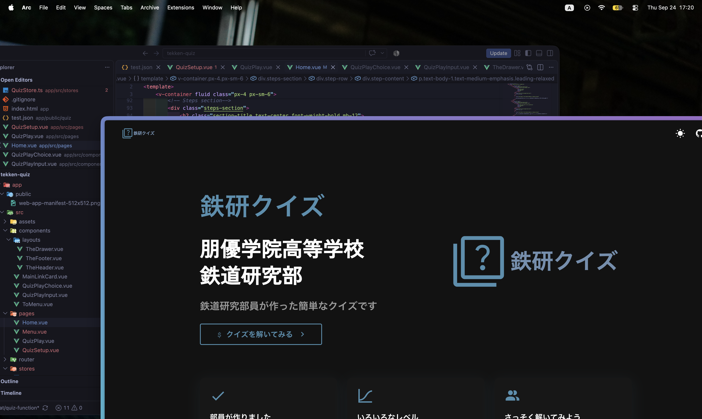
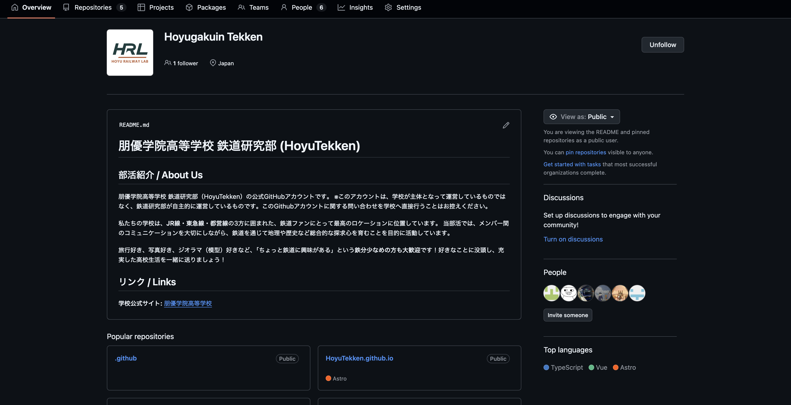
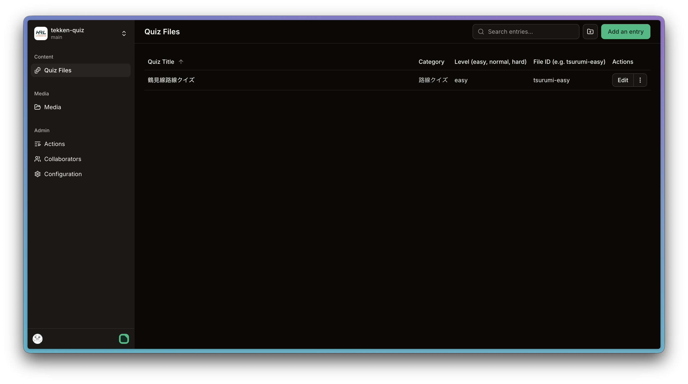

<h1>鉄研クイズ</h1>

[鉄研クイズはこちらから](https://hoyutekken.github.io/tekken-quiz)

> **鉄道研究部員が作った鉄道クイズ**

<p style="display: inline">
    <a href="https://www.docker.com/" target="_blank"></a>
    <a href="https://vuejs.org//" target="_blank"></a>
    <a href="https://www.typescriptlang.org/" target="_blank"></a>
    <a href="https://github.com" target="_blank"></a>
</p>



## 主な特徴

### 1. 部員が作りました

朋優学院の鉄道研究部の部員が作った鉄道に関するクイズをプレイすることができます

### 2. いろいろなレベル

かんたんなクイズから難しいクイズまでさまざまなレベルのクイズを用意しています

### 3. さっそく解いてみよう

あなたも朋優学院鉄研の鉄研クイズを解いて鉄道に関する知識を一緒に深めましょう

## さっそく使う

### 前提

- Docker & Docker Compose

### インストール

1. **レポジトリーを取得する**

    ```bash
    git clone git@github.com:hoyutekken/tekken-quiz.git
    cd tekken-quiz
    ```

2. **Dockerコンテナーをビルド**

    ```bash
    docker compose up -d --build
    ```

3. **鉄研クイズにアクセス**
   [http://localhost:5173](http://localhost:5173 "http://localhost:5173")
   

## ライブラリ

| ライブラリ / ツール | バージョン           | 使途                         |
| :------------------ | :------------------- | :--------------------------- |
| **Docker**          | Latest               | プロジェクト実行環境         |
| **Node.js**         | ^22.18.0 / >=24.12.0 | ランタイム環境 (エンジン)    |
| **TypeScript**      | ~6.0.0               | 言語 / 型チェック            |
| **Vite**            | ^8.2.2               | ビルドツール / 開発サーバー  |
| **Vue.js**          | ^3.5.42              | フロントエンドフレームワーク |
| **Vue Router**      | ^4.6.4               | ルーティング                 |
| **Vuetify**         | ^4.2.1               | UIコンポーネントライブラリ   |
| **Pinia**           | ^4.0.3               | 状態管理                     |
| **Sass**            | ^1.104.1             | CSSプリプロセッサ            |
| **mdi Font**        | ^7.4.47              | アイコンフォント             |

## Pages CMSに関して

> [!NOTE]
> 問題の追加や編集は朋優学院高等学校鉄道研究部の
> 組織アカウントに属し、権限がある人のみ行うことができます。

Pages CMSを利用するとパソコンなどがなくても簡単に問題を追加することができます。

[PagesCMSにここからアクセス](https://app.pagescms.org/hoyutekken/tekken-quiz/main/collection/quiz_files)


Pages CMSでの問題編集や追加は朋優鉄研のGitHub組織アカウントに属し、権限を持っている人しかできません。
